# 🏫 Modern School – Serverless Student Management on AWS

> A fully serverless web application to add and view student records, built with AWS S3, Lambda, API Gateway, DynamoDB, and IAM — no servers required.

---

## 📋 Table of Contents

- [Project Overview](#project-overview)
- [Architecture](#architecture)
- [AWS Infrastructure](#aws-infrastructure)
- [Application Stack](#application-stack)
- [Project Structure](#project-structure)
- [Deployment Guide](#deployment-guide)
- [API Reference](#api-reference)
- [Screenshots](#screenshots)

---

## 📌 Project Overview

**Modern School** is a serverless student management portal that allows users to:
- ➕ **Add** student records (ID, Name, Class, Age)
- 📋 **View** all stored student records in a table

All data is stored in **Amazon DynamoDB** and accessed via **AWS Lambda** functions exposed through **API Gateway**. The frontend is hosted as a static website on **Amazon S3**.

---

## 🏗️ Architecture

```
                    ┌──────────────────────────────────────────────────┐
                    │        Amazon S3 Bucket: 1013-serverless          │
                    │   index.html | add_student.html                  │
                    │   fetch_all_students.html | scripts.js           │
                    └───────────────────┬──────────────────────────────┘
                                        │  HTTP Requests (Fetch API)
                                        ▼
                    ┌──────────────────────────────────────────────────┐
                    │          Amazon API Gateway: MyForwarder          │
                    │    REST API | Regional | Stage: production        │
                    │  GET  /  ──────────────► ReadDB (Lambda)         │
                    │  POST /  ──────────────► WriteDB (Lambda)        │
                    │  OPTIONS / ────────────► Mock (CORS)             │
                    └──────────────┬───────────────────┬───────────────┘
                                   │                   │
                         ┌─────────▼──────┐  ┌─────────▼──────┐
                         │  Lambda:ReadDB  │  │ Lambda:WriteDB │
                         │  Python 3.14   │  │  Python 3.14   │
                         └────────┬───────┘  └────────┬───────┘
                                  │                   │
                         ┌────────▼───────────────────▼────────┐
                         │          Amazon DynamoDB             │
                         │    Table: studentData                │
                         │    Partition Key: studentid (String) │
                         │    Capacity: On-demand               │
                         └──────────────────────────────────────┘
                                          ▲
                         ┌────────────────┴─────────────────────┐
                         │            IAM Role                   │
                         │   b1013-lam-dynmamoDB                 │
                         │   Policy: AmazonDynamoDBFullAccess    │
                         └───────────────────────────────────────┘
```

---

## ☁️ AWS Infrastructure

| Component | Service | Details |
|-----------|---------|---------|
| **Frontend Hosting** | Amazon S3 | Bucket: `1013-serverless` — 4 files (HTML + JS), static website hosting, public bucket policy |
| **IAM Role** | AWS IAM | Role: `b1013-lam-dynmamoDB` — Policy: `AmazonDynamoDBFullAccess` (AWS managed) |
| **Database** | Amazon DynamoDB | Table: `studentData`, Partition Key: `studentid` (String), On-demand capacity, Status: Active |
| **Backend** | AWS Lambda | `ReadDB` (Python 3.14) — scans and returns all student records from DynamoDB |
| **Backend** | AWS Lambda | `WriteDB` (Python 3.14) — inserts a new student record into DynamoDB |
| **API** | Amazon API Gateway | REST API: `MyForwarder`, Regional, Stage: `production`, GET + POST + OPTIONS (CORS), Status: Available |

---

## 🧰 Application Stack

| Layer | Technology |
|-------|-----------|
| **Frontend** | HTML5, CSS3, JavaScript (Fetch API) |
| **Backend** | AWS Lambda (Python 3.14) |
| **Database** | Amazon DynamoDB (On-demand) |
| **API** | Amazon API Gateway (REST, Regional) |
| **Hosting** | Amazon S3 (Static Website) |
| **Auth/Permissions** | AWS IAM Role |

---

## 📁 Project Structure

```
modern-school/
├── index.html                # Home page — Add Student / View All Students
├── add_student.html          # Form to add a new student
├── fetch_all_students.html   # Table view of all students
├── scripts.js                # Frontend JS — POST (WriteDB) & GET (ReadDB) API calls
├── screenshots/              # Project screenshots
└── README.md
```

---

## 🚀 Deployment Guide

### Step 1: Create IAM Role

1. Go to **IAM** → **Roles** → **Create Role**
2. Trusted entity: **AWS Service** → **Lambda**
3. Attach policy: `AmazonDynamoDBFullAccess`
4. Role name: `b1013-lam-dynmamoDB` → **Create role**

---

### Step 2: Create DynamoDB Table

1. Go to **DynamoDB** → **Tables** → **Create table**
2. Table name: `studentData`
3. Partition key: `studentid` → Type: **String**
4. Table settings: **Default settings** (On-demand)
5. Click **Create table**

---

### Step 3: Create Lambda Functions

Create **2 Lambda functions** (Runtime: Python 3.14), both using the IAM role from Step 1:

#### `ReadDB` — Fetch all students (GET)
```python
import boto3
import json

def lambda_handler(event, context):
    dynamodb = boto3.resource('dynamodb')
    table = dynamodb.Table('studentData')
    response = table.scan()
    return {
        'statusCode': 200,
        'headers': {
            'Access-Control-Allow-Origin': '*',
            'Access-Control-Allow-Headers': 'Content-Type',
        },
        'body': json.dumps(response['Items'])
    }
```

#### `WriteDB` — Insert a student (POST)
```python
import boto3
import json

def lambda_handler(event, context):
    dynamodb = boto3.resource('dynamodb')
    table = dynamodb.Table('studentData')
    body = json.loads(event['body'])
    table.put_item(Item={
        'studentid': body['studentid'],
        'name':      body['name'],
        'class':     body['class'],
        'age':       body['age']
    })
    return {
        'statusCode': 200,
        'headers': {
            'Access-Control-Allow-Origin': '*',
            'Access-Control-Allow-Headers': 'Content-Type',
        },
        'body': json.dumps('Student saved successfully!')
    }
```

---

### Step 4: Create API Gateway

1. Go to **API Gateway** → **Create API** → **REST API** → **New API**
2. API name: `MyForwarder`, Endpoint type: **Regional** → **Create API**
3. On root resource `/`, create methods:
   - **GET** → Lambda integration → `ReadDB`
   - **POST** → Lambda integration → `WriteDB`
4. Click **Enable CORS** (enables OPTIONS mock method automatically)
5. Click **Deploy API** → New Stage → Stage name: `production`
6. Copy the **Invoke URL**: `https://8xyaa375hl.execute-api.ap-south-1.amazonaws.com/production`
7. Update `scripts.js`:

```javascript
var API_ENDPOINT = "https://8xyaa375hl.execute-api.ap-south-1.amazonaws.com/production";
```

---

### Step 5: Host Frontend on S3

1. Go to **S3** → **Create bucket**: `1013-serverless`
2. Uncheck **Block all public access**
3. Upload 4 files: `index.html`, `add_student.html`, `fetch_all_students.html`, `scripts.js`
4. Go to **Properties** → **Static Website Hosting** → Enable → Index document: `index.html`
5. Go to **Permissions** → **Bucket Policy** → Add:

```json
{
  "Version": "2012-10-17",
  "Statement": [
    {
      "Effect": "Allow",
      "Principal": "*",
      "Action": "s3:GetObject",
      "Resource": "arn:aws:s3:::1013-serverless/*"
    }
  ]
}
```

6. Visit the **S3 Static Website Endpoint URL** to access the app ✅

---

## 🔌 API Reference

| Method | Endpoint | Lambda | Description |
|--------|----------|--------|-------------|
| `GET` | `/` | `ReadDB` | Fetch all students from DynamoDB |
| `POST` | `/` | `WriteDB` | Add a new student to DynamoDB |
| `OPTIONS` | `/` | Mock | CORS preflight handler |

**Invoke URL:** `https://8xyaa375hl.execute-api.ap-south-1.amazonaws.com/production`

**Example POST body:**
```json
{
  "studentid": "1",
  "name": "Amit",
  "class": "5",
  "age": "10"
}
```

---

## 📸 Screenshots

### 🌐 Web Application

**Home Page – Welcome to Modern School**

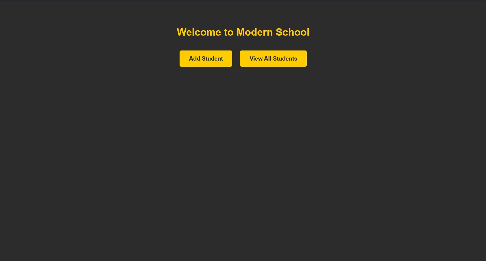

**Add Student Form**

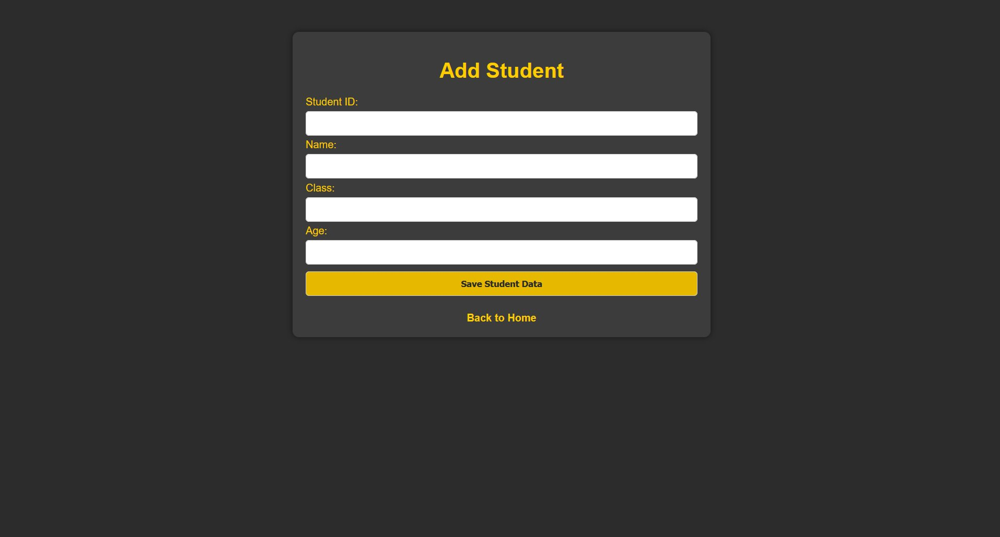

**View All Students – Live Data from DynamoDB**

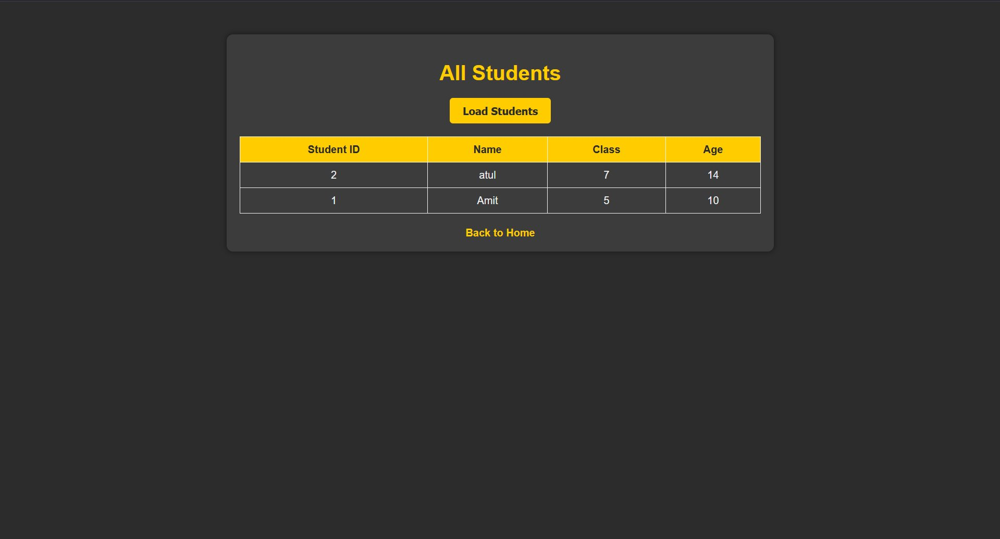

---

### ☁️ AWS Infrastructure

**IAM Role – b1013-lam-dynmamoDB (AmazonDynamoDBFullAccess)**

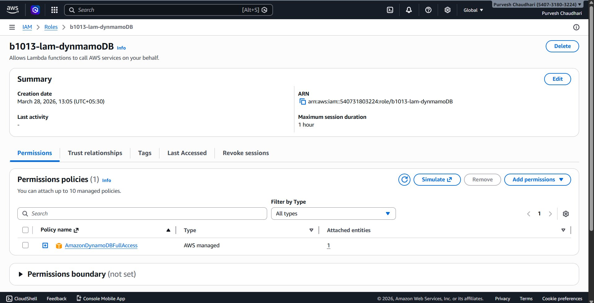

**DynamoDB – Create Table (studentData, Partition Key: studentid)**

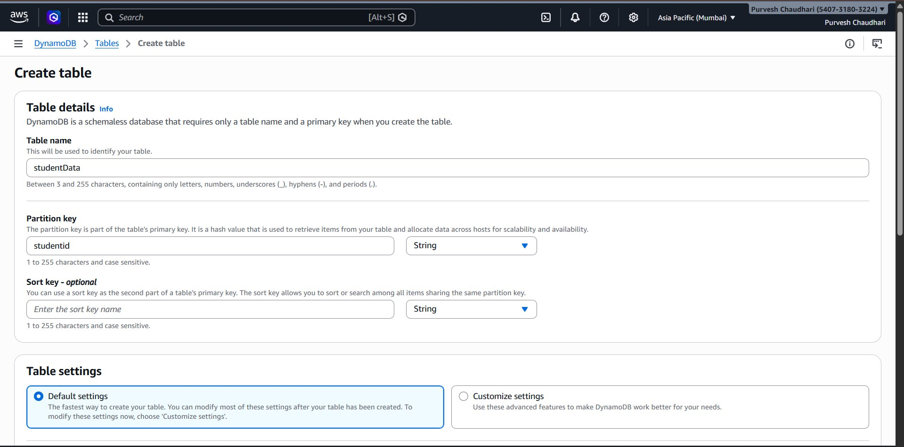

**DynamoDB – Table: studentData (Active, On-demand)**

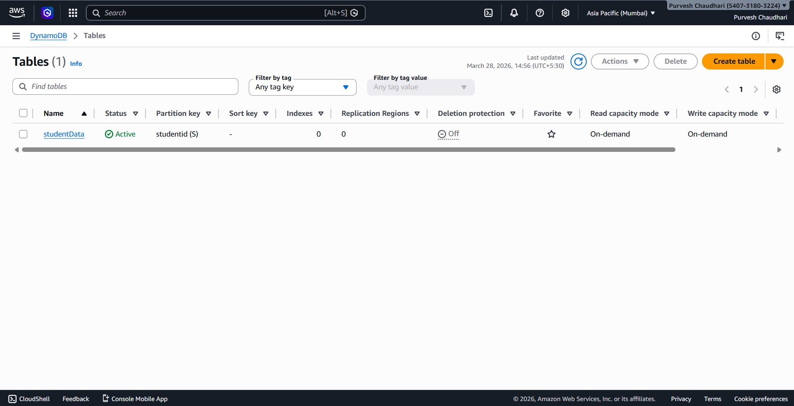

**DynamoDB – Items (2 student records: Amit & atul)**

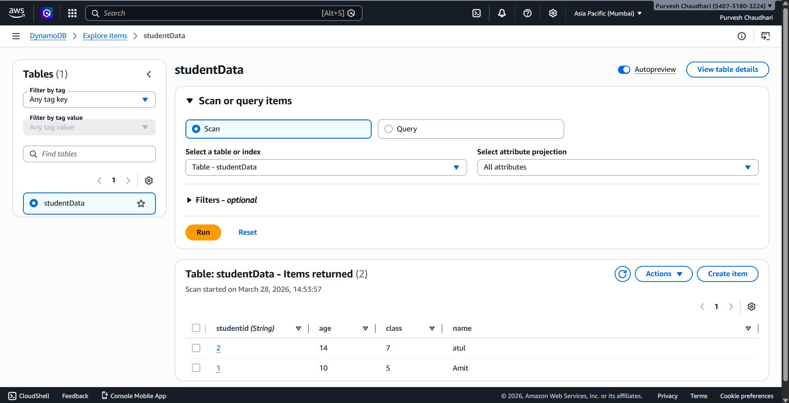

**Lambda – Functions: WriteDB & ReadDB (Python 3.14)**

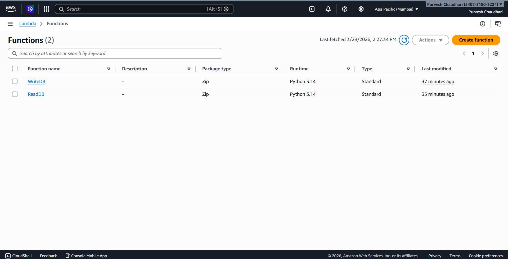

**API Gateway – MyForwarder REST API (Regional, Available)**

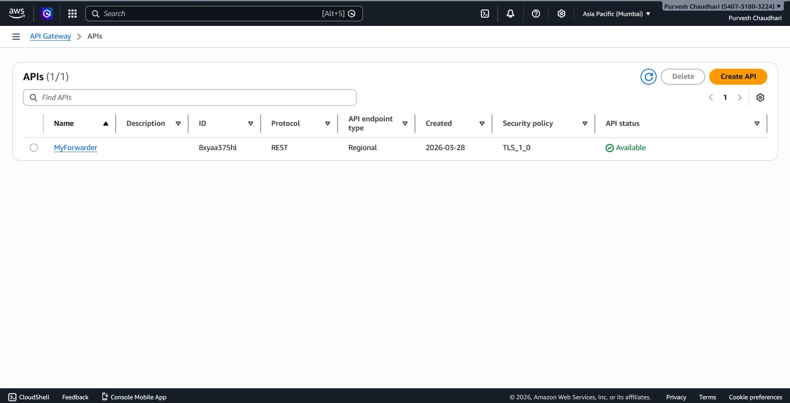

**API Gateway – Resources: GET, POST, OPTIONS on /**

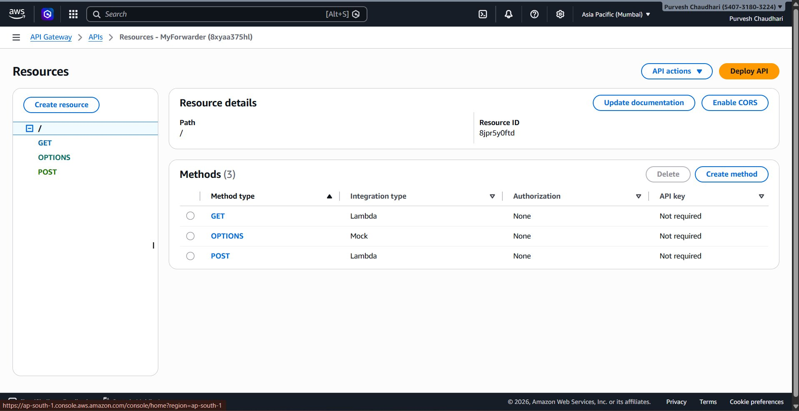

**API Gateway – Stage: production (Invoke URL)**

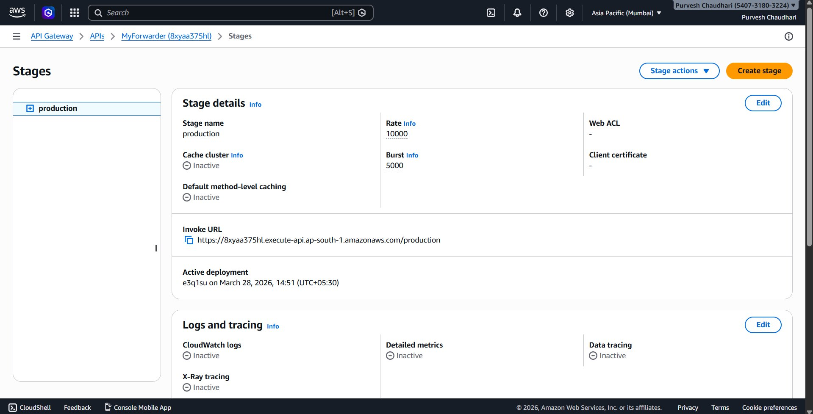

**S3 Bucket – 1013-serverless (4 files uploaded)**

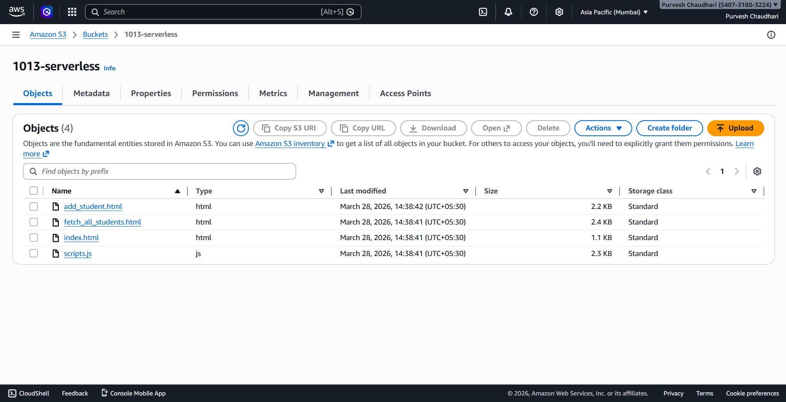

---

## 📜 License

This project is for educational/training purposes.
